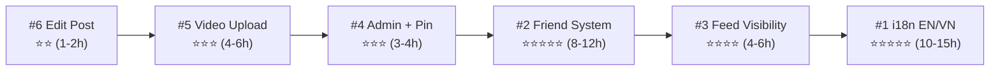

# Phân tích yêu cầu mới — Runly App

## Tổng quan

6 yêu cầu mới, sắp xếp theo mức độ ảnh hưởng từ lớn → nhỏ:

| # | Yêu cầu | Độ phức tạp | Ảnh hưởng |
|---|---------|-------------|-----------|
| 1 | 🌐 Đa ngôn ngữ EN/VN | ⭐⭐⭐⭐⭐ | Toàn bộ app + server |
| 2 | 👫 Kết bạn (Friend System) | ⭐⭐⭐⭐⭐ | Model mới + UI mới + Socket mới |
| 3 | 🔒 Feed visibility (bạn bè/nhóm/profile) | ⭐⭐⭐⭐ | Thay đổi logic Feed + Post model |
| 4 | 📌 Admin/Official account + ghim bài | ⭐⭐⭐ | Post model + Feed logic + UI |
| 5 | 🎬 Upload video | ⭐⭐⭐ | Cloudinary + Upload middleware + UI |
| 6 | ✏️ Edit bài viết | ⭐⭐ | Đã có sẵn backend, chỉ thiếu UI |

---

## 1. 🌐 Đa ngôn ngữ EN/VN

### Phân tích hiện trạng
- **Toàn bộ app hiện tại hardcode tiếng Việt** — từ UI labels, error messages, đến server responses.
- Server trả message bằng tiếng Việt: `"Đăng ký thành công"`, `"Email đã được sử dụng"`, v.v.
- Flutter app: tất cả text trong widgets đều hardcode VN.
- Không có hệ thống i18n nào được cài đặt.

### Phạm vi ảnh hưởng

**Flutter App (lớn nhất):**
- ~70+ file `.dart` chứa hardcoded text cần extract
- Cần thêm package `flutter_localizations` + `intl` (đã có `intl`)
- Tạo file ARB: `app_en.arb`, `app_vi.arb`
- Logic detect locale: `Platform.localeName` hoặc IP-based
- Thêm tùy chọn đổi ngôn ngữ trong Settings

**Server (trung bình):**
- ~15 controller/service files chứa Vietnamese error messages
- 2 options:
  - **Option A:** Server trả error code, app map sang text → Sạch nhưng phải sửa app error handling
  - **Option B:** Server nhận `Accept-Language` header, trả message đúng ngôn ngữ → Phức tạp server

**Web Admin:**
- Hiện tại chỉ Super Admin dùng, có thể giữ nguyên VN

### Câu hỏi cần làm rõ

> [!IMPORTANT]
> 1. **Server messages:** Server nên trả error code hay trả message theo ngôn ngữ? Recommend: Server trả error code, app tự map text — dễ maintain hơn.
> 2. **Default logic cụ thể:** Detect bằng `Platform.localeName` (OS language) hay bằng IP geolocation? Recommend: OS locale — đơn giản, không cần API bên ngoài.
> 3. **Scope web admin:** Web admin có cần đa ngôn ngữ không? Recommend: Không, giữ VN.

---

## 2. 👫 Kết bạn (Friend System)

### Phân tích hiện trạng
- **Hiện tại không có khái niệm "bạn bè"** trong hệ thống.
- User chỉ liên kết qua: Company → Group → Member.
- Chat hiện tại: group chat (auto-created khi tạo group) + direct message (bất kỳ ai cùng company).
- Không có model Friendship/FriendRequest.

### Phạm vi ảnh hưởng

**Server — Model mới:**
```
FriendRequest: {
  senderId, receiverId, status (pending/accepted/rejected), createdAt
}
```
- Thêm field `friends: [ObjectId]` vào User model
- Hoặc tạo riêng `Friendship` model (scalable hơn)

**Server — API mới:**
| Method | Path | Description |
|---|---|---|
| POST | /friends/request/:userId | Gửi lời mời kết bạn |
| PUT | /friends/accept/:requestId | Chấp nhận |
| PUT | /friends/reject/:requestId | Từ chối |
| DELETE | /friends/:userId | Hủy kết bạn |
| GET | /friends | DS bạn bè |
| GET | /friends/requests | DS lời mời đang chờ |
| GET | /friends/suggestions | Gợi ý (cùng company/group) |

**Server — Socket events mới:**
- `friend:request` — Notification real-time khi nhận lời mời
- `friend:accepted` — Notification khi được chấp nhận

**Flutter App — UI mới:**
- Friend list page (tab trong Chat hoặc trang riêng)
- Friend request notification badge
- Nút "Kết bạn" trên profile user
- Friend suggestions UI
- Sửa Profile page: hiển thị trạng thái bạn bè

### Câu hỏi cần làm rõ

> [!IMPORTANT]
> 1. **Scope kết bạn:** Chỉ trong cùng company hay cross-company? Recommend: Cùng company trước.
> 2. **Auto-friend:** Khi tham gia cùng group có auto thành bạn không? Hay phải gửi lời mời?
> 3. **Friend limit:** Có giới hạn số bạn bè không?
> 4. **Block vs Unfriend:** Unfriend khác gì block? Block hiện tại đã có — unfriend chỉ bỏ khỏi friend list nhưng vẫn thấy nhau?
> 5. **DM restriction:** Hiện tại bất kỳ ai cùng company đều nhắn tin được. Sau khi có friend system, chỉ bạn bè mới nhắn tin được? Hay giữ nguyên?

---

## 3. 🔒 Feed Visibility (bạn bè / nhóm / profile)

### Phân tích hiện trạng
- Post.visibility hiện có: `public` (tất cả cùng company), `groups` (chỉ nhóm cụ thể)
- Feed query hiện tại: `public` OR `user thuộc visibleToGroups[]`
- **Không có visibility `friends`** — cần thêm

### Phạm vi ảnh hưởng

**Server — Post model:**
```diff
visibility: {
  type: String,
- enum: ['public', 'groups'],
+ enum: ['public', 'friends', 'groups'],
  default: 'public',
}
```

**Server — Feed query logic (post.service.js `getFeed`):**
```
Hiện tại:
  $or: [ {public}, {visibleToGroups ∩ userGroups} ]

Sau:
  $or: [
    { visibility: 'public', authorId == admin/official },  // Chỉ admin post mới public all
    { visibility: 'friends', authorId ∈ userFriends },     // Bạn bè
    { visibility: 'groups', visibleToGroups ∩ userGroups }, // Nhóm
  ]
```

**Profile page — xem bài viết:**
- Vào profile user khác → thấy bài viết NHƯNG tùy visibility:
  - `public`: thấy hết
  - `friends`: chỉ thấy nếu là bạn bè
  - `groups`: chỉ thấy nếu cùng nhóm

**Flutter App:**
- Thêm option `friends` vào `_VisibilitySheet` trong CreatePostPage
- Sửa FeedBloc/FeedPage hiển thị icon visibility
- Sửa ProfilePage: thêm tab "Bài viết" với logic filter

> [!WARNING]
> Feature #3 **phụ thuộc Feature #2** (Friend System). Không thể làm visibility `friends` nếu chưa có friend list. → Phải làm #2 trước.

### Câu hỏi cần làm rõ

> [!IMPORTANT]
> 1. **Default visibility:** Khi tạo post mới, default là `public` hay `friends`?
> 2. **Profile xem bài:** Vào profile người lạ (không phải bạn, không cùng nhóm) thì thấy gì? Chỉ thấy thông tin cơ bản (avatar, tên) mà không thấy bài viết?
> 3. **Bài cũ:** Các bài đã đăng trước khi có friend system → giữ public hay migrate?

---

## 4. 📌 Admin / Official Account + Ghim bài

### Phân tích hiện trạng
- Role hiện có: `super_admin`, `company_admin`, `member`
- `company_admin` có quyền tạo/xóa group, tạo contest — nhưng **không có quyền đặc biệt trong Feed**
- Không có khái niệm "official post" hay "pinned post"

### Phạm vi ảnh hưởng

**Server — Post model thêm fields:**
```javascript
isPinned: { type: Boolean, default: false },
pinnedAt: { type: Date, default: null },
pinnedBy: { type: ObjectId, ref: 'User', default: null },
isOfficial: { type: Boolean, default: false },  // auto-set nếu author là admin
```

**Server — Feed logic:**
- Bài từ `company_admin` (hoặc role mới `official`) → tự động visible cho **tất cả user trong company**, bất kể visibility setting
- Feed sort: pinned posts luôn ở đầu (`isPinned: -1, pinnedAt: -1, createdAt: -1`)

**Server — API mới:**
| Method | Path | Role | Description |
|---|---|---|---|
| PUT | /posts/:id/pin | company_admin | Ghim/bỏ ghim bài |

**Flutter App:**
- Feed: hiển thị banner "📌 Bài ghim" + style khác biệt cho official posts
- Post card: badge "Official" cho bài từ admin
- CreatePostPage: nếu user là admin → hiện option "Ghim bài"
- Admin có thể ghim bài của người khác

### Câu hỏi cần làm rõ

> [!IMPORTANT]
> 1. **Role nào là "official"?** Dùng luôn `company_admin` hiện có, hay tạo role mới `official`?
> 2. **Giới hạn ghim:** Tối đa bao nhiêu bài ghim cùng lúc? Recommend: 3-5 bài.
> 3. **Ai thấy bài admin?** Tất cả user **cùng company** hay **toàn app** (cross-company)? Recommend: Cùng company.
> 4. **Admin ghim bài người khác:** Admin có thể ghim bài của member không? Hay chỉ ghim bài mình?

---

## 5. 🎬 Upload Video

### Phân tích hiện trạng
- Upload hiện tại **chỉ hỗ trợ image** (jpg, png, gif, webp)
- Middleware `upload.js`: `fileFilter` chỉ cho phép `image/*` MIME types
- Cloudinary storage: `allowed_formats: ['jpg', 'jpeg', 'png', 'gif', 'webp']`
- Post model `media[]`: chỉ có `{url, publicId, width, height}` — không có field `type` (image/video)
- Flutter `CreatePostPage`: chỉ gọi `pickMultiImage` / `pickImage`
- **Cloudinary hỗ trợ video** (mp4, mov, avi) — cần upgrade plan nếu dung lượng lớn

### Phạm vi ảnh hưởng

**Server:**
- `upload.js`: thêm video MIME types (`video/mp4`, `video/quicktime`, `video/x-msvideo`)
- Cloudinary config: `resource_type: 'auto'` thay vì chỉ image
- Tăng `fileSize` limit (video có thể 50-100MB)
- Post model `media[]`: thêm `type: { enum: ['image', 'video'] }`, `thumbnail`, `duration`

**Flutter App:**
- CreatePostPage: thêm `pickVideo()` option
- PostCard widget: render video player (package `video_player` hoặc `chewie`)
- Image gallery viewer: xử lý mix image + video

**Cân nhắc kỹ thuật:**
- Video compression trước khi upload (package `video_compress`)
- Thumbnail generation (Cloudinary auto hoặc client-side)
- Giới hạn duration (30s? 60s? 3 phút?)
- Cloudinary bandwidth cost

### Câu hỏi cần làm rõ

> [!IMPORTANT]
> 1. **Max duration:** Giới hạn thời lượng video bao nhiêu? Recommend: 60 giây ban đầu.
> 2. **Max file size:** Recommend: 50MB sau compress.
> 3. **Cloudinary plan:** Plan hiện tại có hỗ trợ video upload/bandwidth không? Cần kiểm tra quota.
> 4. **Mix media:** 1 post có thể vừa ảnh vừa video không? Hay tách riêng?
> 5. **Video trong chat:** Chat cũng cần gửi video không? Hay chỉ Feed?

---

## 6. ✏️ Edit bài viết

### Phân tích hiện trạng
- **Backend đã có sẵn!** `PUT /posts/:id` → `postService.updatePost()` → chỉ cho phép sửa `content` (author only)
- **Flutter app chưa có UI edit** — PostCard chỉ có menu "Xóa bài viết", không có "Chỉnh sửa"

### Phạm vi ảnh hưởng (nhỏ nhất)

**Server:** Gần như không cần sửa. Có thể mở rộng `allowedUpdates` thêm `visibility`, `visibleToGroups` nếu muốn user sửa cả phạm vi hiển thị.

**Flutter App:**
- `PostCard` widget: thêm menu item "Chỉnh sửa" (chỉ hiện cho author)
- Tạo `EditPostPage` (tương tự CreatePostPage nhưng pre-fill content)
- Hoặc đơn giản hơn: in-place edit dialog

### Câu hỏi cần làm rõ

> [!IMPORTANT]
> 1. **Scope edit:** Chỉ sửa nội dung text? Hay cả ảnh/video, visibility?
> 2. **Edit history:** Có cần hiển thị "đã chỉnh sửa" badge không? Recommend: Có, thêm `editedAt` vào Post model.
> 3. **Time limit:** Có giới hạn thời gian sửa không? (VD: chỉ sửa trong 24h)

---

## Thứ tự triển khai khuyến nghị



**Lý do thứ tự:**
1. **#6 Edit Post** → Nhỏ nhất, ship nhanh, tạo momentum
2. **#5 Video** → Độc lập, không phụ thuộc feature khác
3. **#4 Admin + Pin** → Cần trước Feed visibility để define rõ role
4. **#2 Friend System** → Foundation cho #3
5. **#3 Feed Visibility** → Phụ thuộc #2 (friend list)
6. **#1 i18n** → Để cuối vì ảnh hưởng toàn bộ, nên làm khi các feature khác đã stable

---

Hãy review và trả lời các câu hỏi ở mỗi section để tôi lên kế hoạch triển khai chi tiết! 🎯
