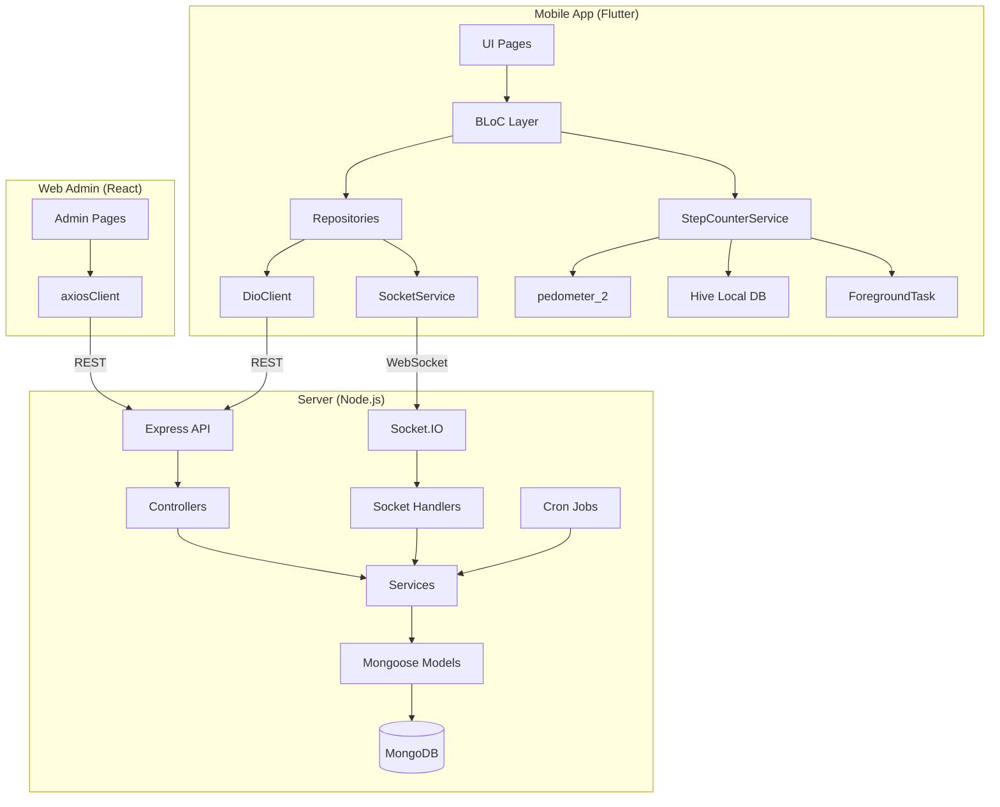
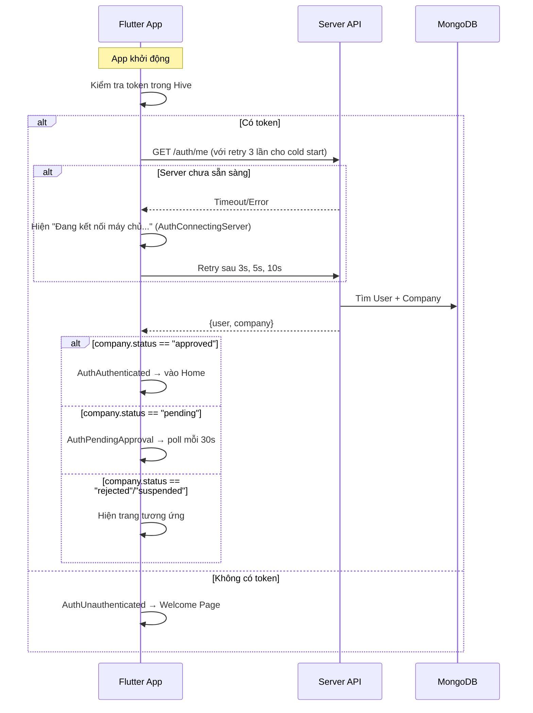
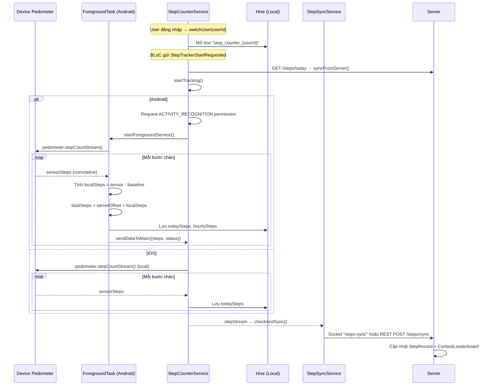
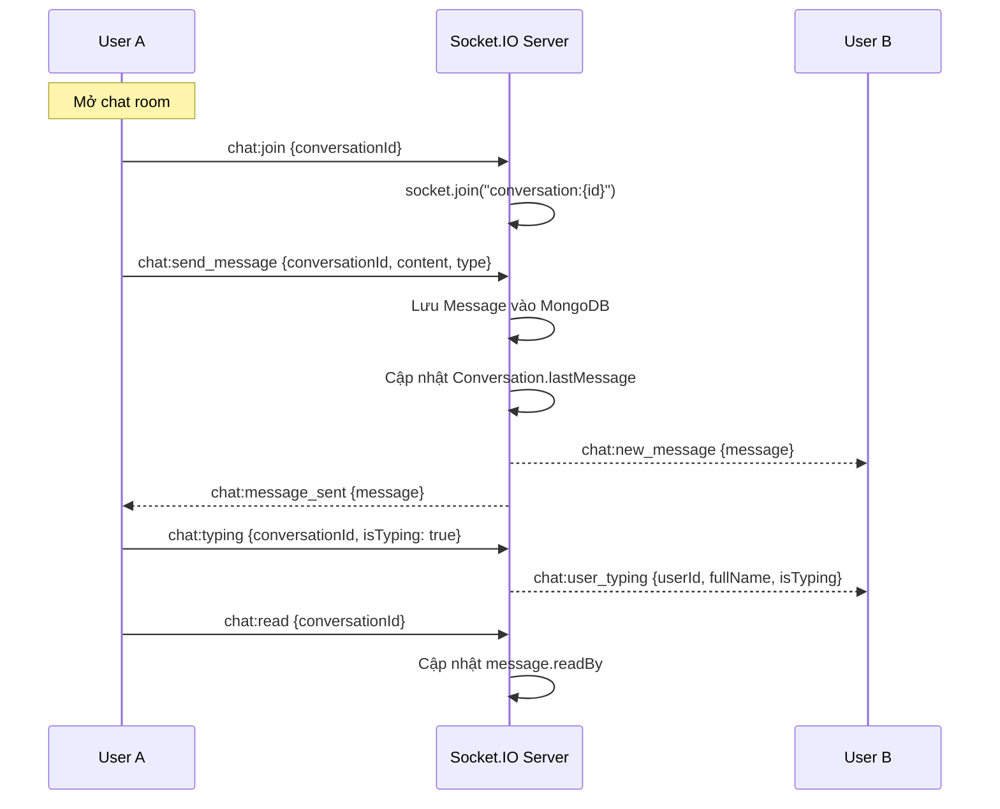

# Runly — Tài liệu kỹ thuật chi tiết

## 1. Tổng quan dự án

**Runly** (tên package: `walktogether_app`) là ứng dụng đếm bước chân & thi đấu theo nhóm trong doanh nghiệp. Hệ thống gồm 3 thành phần:

| Thành phần | Tech Stack | Thư mục |
|---|---|---|
| Mobile App | Flutter 3.41.7, Dart 3.11.5, BLoC | `walktogether_app/` |
| Backend API | Node.js, Express, MongoDB, Socket.IO | `server/` |
| Web Admin | React (Vite), React Router | `web-admin/` |

**Production URLs:**
- API: `https://walking-production.up.railway.app/api/v1`
- Socket: `https://walking-production.up.railway.app` (WebSocket)

---

## 2. Kiến trúc tổng thể



### 2.1 Flutter App Architecture (Clean Architecture + BLoC)

```
lib/
├── main.dart                    # Entry point, DI setup
├── core/
│   ├── constants/               # API endpoints, colors, text styles
│   ├── network/                 # DioClient, API exceptions
│   ├── router/                  # GoRouter with auth guard
│   ├── services/                # StepCounter, StepSync, Storage
│   ├── socket/                  # SocketService singleton
│   ├── theme/                   # AppTheme
│   └── utils/                   # Helpers, validators
├── features/
│   ├── auth/                    # Login, Register, Company approval
│   ├── step_tracker/            # Step counting, goals, sync
│   ├── group/                   # Group CRUD, QR join
│   ├── chat/                    # Real-time messaging
│   ├── contest/                 # Competitions, leaderboard
│   ├── feed/                    # Social posts, likes, comments
│   ├── profile/                 # User profile
│   ├── settings/                # App settings, password, blocked users
│   └── home/                    # Bottom nav shell
└── shared/widgets/              # Reusable widgets
```

---

## 3. Database Models (MongoDB)

### 3.1 User
| Field | Type | Notes |
|---|---|---|
| email | String | unique, sparse |
| phone | String | unique, sparse |
| password | String | bcrypt hashed, `select: false` |
| fullName | String | required |
| avatar | String | Cloudinary URL |
| role | enum | `super_admin`, `company_admin`, `member` |
| companyId | ObjectId → Company | |
| companyCode | String | |
| isActive | Boolean | soft delete flag |
| blockedUsers | [ObjectId → User] | |
| lastOnline | Date | |
| deletedAt | Date | |
| acceptedTermsAt | Date | |

### 3.2 Company
| Field | Type | Notes |
|---|---|---|
| name, email, phone, address, description | String | |
| logo | String | |
| code | String | unique, auto-generated on approval |
| status | enum | `pending`, `approved`, `rejected`, `suspended` |
| adminId | ObjectId → User | |
| totalMembers | Number | |

### 3.3 Group
| Field | Type | Notes |
|---|---|---|
| name, description | String | |
| avatar | String | |
| companyId | ObjectId → Company | required |
| createdBy | ObjectId → User | |
| members | [ObjectId → User] | |
| isActive | Boolean | |

### 3.4 Conversation & Message
**Conversation:** `type` (group/direct), `groupId`, `participants[]`, `lastMessage`, `companyId`

**Message:** `conversationId`, `senderId`, `type` (text/image/system/shared_post), `content`, `imageUrl`, `sharedPostId`, `readBy[]`

### 3.5 Post, Like, Comment
**Post:** `authorId`, `companyId`, `visibility` (public/groups), `visibleToGroups[]`, `type`, `content`, `images[]`, `achievement{}`, `likesCount`, `commentsCount`

**Like:** `userId` + `postId` (unique compound index)

**Comment:** `postId`, `authorId`, `content`, `isActive`

### 3.6 StepRecord
| Field | Type | Notes |
|---|---|---|
| userId + date | compound unique | one record per user per day |
| steps | Number | |
| distance | Number | meters (steps × 0.762) |
| calories | Number | kcal (steps × 0.04) |
| hourlySteps | Map\<String, Number\> | `{"08": 500, "09": 1200}` |
| syncedAt | Date | |

### 3.7 Contest & ContestLeaderboard
**Contest:** `name`, `groupId`, `companyId`, `createdBy`, `startDate`, `endDate`, `status` (upcoming/active/completed/cancelled), `participants[]`

**ContestLeaderboard:** `contestId`, `userId`, `totalSteps`, `dailySteps` (Map), `rank`

### 3.8 Report & UserSettings
**Report:** `reporterId`, `targetType` (post/comment/user), `targetId`, `reason`, `status`

**UserSettings:** `userId`, `dailyGoalSteps`, `notifications{}`, `units`

---

## 4. Business Flows

### 4.1 Authentication Flow



**Đăng ký:** User nhập email/phone + password + fullName + companyCode (optional). Server tạo User với role `member`, liên kết companyId nếu có code.

**Đăng nhập:** Tìm user bằng email HOẶC phone → bcrypt compare → trả JWT (access 7d + refresh 30d).

**Token refresh:** DioClient có `_AuthInterceptor` tự động refresh khi nhận 401.

### 4.2 Step Tracking Flow (Core Feature)



**Quan trọng:**
- **Baseline logic:** Sensor trả về cumulative steps từ boot. `baseline` = giá trị sensor lúc bắt đầu tracking. `localSteps = sensorSteps - baseline`.
- **Server offset:** `totalSteps = serverOffset + localSteps`. ServerOffset giữ giá trị từ server (thiết bị khác sync).
- **Reboot detection:** Nếu `sensorSteps < lastSensorSteps` → reset baseline.
- **Date reset:** Mỗi ngày mới → reset baseline, todaySteps, serverOffset, hourlySteps.
- **Sync strategy:** Socket ưu tiên → REST fallback → Offline queue (Hive).
- **Sync interval:** Mỗi 120s hoặc khi steps thay đổi ≥ 50 bước.

### 4.3 Group Flow

```
Tạo nhóm (company_admin):
  POST /groups → tạo Group + tự tạo Conversation (type: "group")
  
Tham gia nhóm (QR):
  POST /groups/join/:groupId → thêm user vào members + conversation participants
  
Tìm kiếm nhóm:
  GET /groups/search?q=... → tìm trong cùng company

Xóa thành viên:
  DELETE /groups/:id/members/:userId (company_admin only)
```

### 4.4 Chat Flow (Real-time)



**Loại tin nhắn:** text, image (Cloudinary upload), system (join/leave), shared_post.

**Loại conversation:** `group` (auto-created khi tạo Group), `direct` (1-1 giữa 2 user).

### 4.5 Contest Flow

```
1. company_admin tạo Contest:
   POST /contests → status: "upcoming"
   → Tạo ContestLeaderboard entry cho mỗi group member

2. Cron job (mỗi phút):
   upcoming → active (khi startDate đã qua)
   active → completed (khi endDate đã qua) → recalculateRanks()

3. Step sync cập nhật leaderboard:
   steps:sync socket event → updateLeaderboard() → broadcast leaderboard:update

4. Daily aggregation (23:55 mỗi ngày):
   Lấy StepRecord của mỗi participant → updateLeaderboard → recalculateRanks

5. User xem leaderboard:
   GET /contests/:id/leaderboard?date=YYYY-MM-DD (optional filter)
```

### 4.6 Feed Flow (Social)

```
Tạo post:
  POST /posts (multipart: images[], content, visibility, achievement)
  → Upload images lên Cloudinary → lưu URLs

Feed:
  GET /posts/feed → filter theo visibility:
    - public: tất cả cùng company
    - groups: chỉ user thuộc visibleToGroups[]
  → Sắp xếp mới nhất, paginated (limit/offset)

Like:
  POST /posts/:id/like → toggle (tạo/xóa Like document)
  → Socket broadcast "post:liked" / "post:unliked"

Comment:
  POST /posts/:id/comments → tạo Comment
  → Socket broadcast "post:commented"

Share to group chat:
  POST /chat/share-post → tạo Message type "shared_post" trong group conversations
```

### 4.7 Settings & Safety

```
Settings:
  GET/PUT /settings → dailyGoalSteps, notifications{}, units

Change password:
  PUT /auth/change-password → verify current → hash new

Block user:
  POST /auth/block/:id → thêm vào blockedUsers[] + auto tạo Report

Delete account (soft):
  DELETE /auth/account → isActive=false, clear PII, xóa StepRecord, rời Groups
```

---

## 5. API Endpoints

### Auth (`/api/v1/auth`)
| Method | Path | Auth | Description |
|---|---|---|---|
| POST | /register | ✗ | Đăng ký member |
| POST | /register-company | ✗ | Đăng ký company + admin |
| POST | /login | ✗ | Đăng nhập (email/phone) |
| POST | /refresh-token | ✗ | Refresh JWT |
| POST | /logout | ✓ | Đăng xuất |
| GET | /me | ✓ | Profile + company info |
| PUT | /me | ✓ | Cập nhật profile |
| POST | /me/avatar | ✓ | Upload avatar (Cloudinary) |
| GET | /me/stats | ✓ | Thống kê cá nhân |
| PUT | /change-password | ✓ | Đổi mật khẩu |
| DELETE | /account | ✓ | Xóa tài khoản (soft) |
| POST | /block/:id | ✓ | Chặn user |
| DELETE | /block/:id | ✓ | Bỏ chặn |
| GET | /blocked | ✓ | DS đã chặn |

### Groups (`/api/v1/groups`) — Auth + Approved Company
| Method | Path | Role | Description |
|---|---|---|---|
| POST | / | company_admin | Tạo nhóm |
| GET | / | all | DS nhóm |
| GET | /search | all | Tìm nhóm |
| GET | /:id | all | Chi tiết nhóm |
| PUT | /:id | company_admin | Sửa nhóm |
| DELETE | /:id | company_admin | Xóa nhóm |
| POST | /:id/members | company_admin | Thêm thành viên |
| DELETE | /:id/members/:userId | company_admin | Xóa thành viên |
| POST | /join/:groupId | all | Tham gia qua QR |

### Chat (`/api/v1/chat`) — Auth + Approved Company
| Method | Path | Description |
|---|---|---|
| GET | /conversations | DS conversations |
| POST | /conversations/direct | Tạo/lấy DM |
| GET | /conversations/:id/messages | Tin nhắn (paginated) |
| POST | /conversations/:id/messages | Gửi tin (REST fallback) |
| POST | /conversations/:id/upload | Upload ảnh |
| PUT | /conversations/:id/read | Đánh dấu đã đọc |
| POST | /share-post | Share post vào group chat |

### Steps (`/api/v1/steps`) — Auth + Approved Company
| Method | Path | Description |
|---|---|---|
| POST | /sync | Sync steps từ client |
| GET | /today | Bước hôm nay |
| GET | /history?from=&to= | Lịch sử |
| GET | /stats | Thống kê tuần/tháng |

### Contests (`/api/v1/contests`) — Auth + Approved Company
| Method | Path | Role | Description |
|---|---|---|---|
| POST | / | company_admin | Tạo cuộc thi |
| GET | / | all | DS cuộc thi |
| GET | /group/:groupId/active | all | Contest active của group |
| GET | /:id | all | Chi tiết |
| PUT | /:id | company_admin | Sửa (upcoming only) |
| DELETE | /:id | company_admin | Hủy |
| GET | /:id/leaderboard | all | Bảng xếp hạng |

### Posts (`/api/v1/posts`) — Auth + Approved Company
| Method | Path | Description |
|---|---|---|
| GET | /feed | Feed (visibility-filtered) |
| POST | / | Tạo post (multipart images) |
| GET | /:id | Chi tiết post |
| PUT | /:id | Sửa (author only) |
| DELETE | /:id | Xóa (soft) |
| POST | /:id/like | Toggle like |
| GET | /:id/likes | DS likes |
| POST | /:id/comments | Tạo comment |
| GET | /:id/comments | DS comments |

### Admin, Company, Settings, Reports
- `GET /admin/companies` — Super admin: DS companies
- `PUT /admin/companies/:id` — Approve/reject/suspend
- `GET /companies/status` — Company status (cho polling)
- `GET/PUT /settings` — User settings
- `POST /reports` — Báo cáo vi phạm

---

## 6. Socket.IO Events

### Connection
```
Auth: socket.handshake.auth.token → JWT verify
Auto-join: user:{userId}, company:{companyId}, conversation:{id} (all active)
```

### Chat Events
| Event | Direction | Payload |
|---|---|---|
| `chat:join` | Client→Server | `{conversationId}` |
| `chat:leave` | Client→Server | `{conversationId}` |
| `chat:send_message` | Client→Server | `{conversationId, type, content, imageUrl?}` |
| `chat:new_message` | Server→Room | `{message}` |
| `chat:message_sent` | Server→Sender | `{message}` |
| `chat:typing` | Client→Server | `{conversationId, isTyping}` |
| `chat:user_typing` | Server→Room | `{userId, fullName, isTyping}` |
| `chat:read` | Client→Server | `{conversationId}` |

### Step Events
| Event | Direction | Payload |
|---|---|---|
| `steps:sync` | Client→Server | `{date, steps, hourlySteps}` |
| `steps:synced` | Server→Client | `{success, todaySteps, distance, calories}` |
| `steps:error` | Server→Client | `{message}` |

### Leaderboard Events
| Event | Direction | Payload |
|---|---|---|
| `leaderboard:subscribe` | Client→Server | `{contestId}` |
| `leaderboard:update` | Server→Room | `{contestId, leaderboard[]}` |

### Social Events
| Event | Direction | Payload |
|---|---|---|
| `post:liked` | Server→Company | `{postId, userId, likesCount}` |
| `post:commented` | Server→Company | `{postId, userId, comment}` |
| `user:online` / `user:offline` | Server→Company | `{userId, fullName}` |

---

## 7. Cron Jobs

| Job | Schedule | Logic |
|---|---|---|
| **contestChecker** | Mỗi phút | `upcoming→active` khi startDate qua; `active→completed` khi endDate qua + recalculate ranks |
| **stepAggregation** | 23:55 hàng ngày | Lấy StepRecord của participants trong active contests → update leaderboard → recalculate ranks |

---

## 8. Flutter State Management

### BLoCs
| BLoC | Feature | Key States |
|---|---|---|
| AuthBloc | Auth | Initial, Loading, Authenticated, PendingApproval, Rejected, Suspended, Unauthenticated, ConnectingServer |
| StepTrackerBloc | Steps | Initial, Loading, Running (steps, distance, calories, goal, progress, hourlySteps, syncStatus), Error |
| GroupListBloc | Groups | Loading, Loaded, Error |
| GroupDetailBloc | Group detail | Loading, Loaded, Error |
| ConversationListBloc | Chat list | Loading, Loaded, Error |
| ChatBloc | Chat room | Loading, Loaded, Error |
| FeedBloc | Feed | Loading, Loaded, Error |
| PostDetailBloc | Post detail | Loading, Loaded, Error |
| ContestListBloc | Contests | Loading, Loaded, Error |
| ContestDetailBloc | Contest detail | Loading, Loaded, Error |
| LeaderboardBloc | Leaderboard | Loading, Loaded, Error |
| SettingsCubit | Settings | Loading, Loaded, Error |

### Services (Singleton)
| Service | Responsibility |
|---|---|
| StepCounterService | Pedometer, Hive persistence, foreground task, step calculation |
| StepSyncService | Server sync (socket→REST→offline queue), periodic timer |
| SocketService | Socket.IO connection, events |
| StorageService | SharedPreferences (tokens, user data) |

---

## 9. Navigation (GoRouter)

```
/                          → WelcomePage
/login                     → LoginPage
/register                  → RegisterPage
/connecting                → ServerConnectingPage (cold start)
/pending-approval          → PendingApprovalPage
/rejected                  → RejectedPage
/suspended                 → SuspendedPage

ShellRoute (Bottom Nav: Home, Feed, Chat, Profile):
  /home                    → ActivityPage (step tracker)
  /feed                    → FeedPage
  /chat                    → ChatTabsPage
  /profile                 → ProfilePage

Outside Shell (no bottom nav):
  /chat/:id                → ChatPage
  /goals                   → GoalsPage
  /post/create             → CreatePostPage
  /post/:id                → PostDetailPage
  /groups/create            → CreateGroupPage
  /groups/search           → GroupSearchPage
  /groups/qr-scanner       → QRScannerPage
  /groups/:id              → GroupDetailPage
  /groups/:id/qr           → GroupQRPage
  /contests/group/:groupId → ContestListPage
  /contests/create/:groupId → CreateContestPage
  /contests/:id            → ContestDetailPage
  /contests/:id/leaderboard → LeaderboardPage
  /settings                → SettingsPage
  /settings/change-password → ChangePasswordPage
  /settings/blocked        → BlockedUsersPage
  /terms                   → TermsPage
```

**Auth Guard:** GoRouter `redirect` kiểm tra `AuthChangeNotifier` → redirect về `/` nếu chưa login, redirect về `/home` nếu đã login.

---

## 10. Deployment

### Server (Railway)
- Runtime: Node.js
- DB: MongoDB Atlas
- Storage: Cloudinary (images)
- Environment: `MONGODB_URI`, `JWT_SECRET`, `JWT_REFRESH_SECRET`, `CLOUDINARY_*`
- Cold start handling: Client retry 3 lần với delay tăng dần

### Mobile App
- **Android:** `flutter build apk --release` → APK 77.7MB (fat, all architectures)
- **iOS:** Đã publish lên App Store (xử lý Guideline 2.1a, 5.1.1iv, 2.3.6)
- Version: 1.0.0+7
- Min SDK: Android 29 (Android 10), iOS tương đương

### Web Admin (chưa deploy production)
- Vite + React
- Super admin login → Dashboard, Company management (approve/reject/suspend)

---

## 11. Key Dependencies

### Flutter
| Package | Purpose |
|---|---|
| flutter_bloc + equatable | State management |
| go_router | Declarative routing |
| dio | HTTP client |
| socket_io_client | Real-time |
| hive + hive_flutter | Local DB (steps, sync queue) |
| pedometer_2 | Step sensor |
| flutter_foreground_task | Background service (Android) |
| permission_handler | Runtime permissions |
| image_picker + cached_network_image | Image handling |
| qr_flutter + mobile_scanner | QR code |
| intl | Vietnamese locale |

### Server
| Package | Purpose |
|---|---|
| express + cors + helmet | HTTP framework |
| mongoose | MongoDB ODM |
| jsonwebtoken + bcryptjs | Auth |
| socket.io | Real-time |
| multer + cloudinary | File upload |
| node-cron | Scheduled jobs |
| express-rate-limit | Rate limiting |

---

## 12. Middleware Chain (Server)

```
Request → helmet → cors → bodyParser → morgan → globalLimiter
       → authenticate (JWT verify)
       → requireApprovedCompany (company.status check)
       → authorize(role) (role-based access)
       → Controller → Service → Response
       → errorHandler (global catch)
```

---

*Tài liệu này được tạo ngày 2026-05-24 dựa trên phân tích toàn bộ codebase.*
